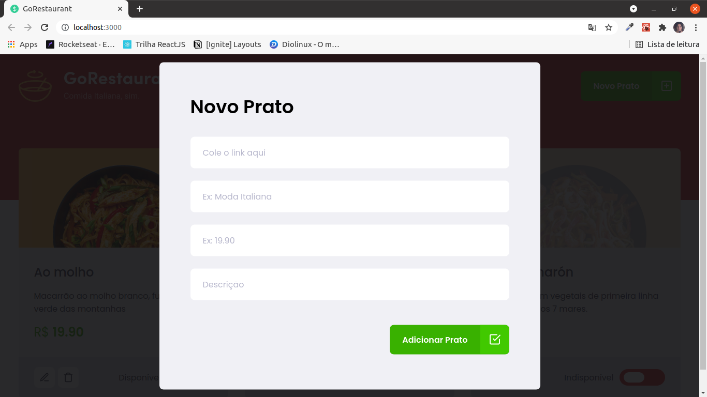

<h1 align="center">
  
</h1>

## Introdução
GoRestaurant é um projeto de dashboard para restaurante, controlando o que vai aparecer no cardápio de um site, aplicativo...
## Primeiro Acesso
### Clonando o projeto
```
$ git clone https://github.com/matheusfd3/go-restaurant.git
```
### Baixando as dependências
Na pasta do projeto execute o comando abaixo com o [Yarn](https://yarnpkg.com/lang/pt-br/).
```
$ yarn install
```
### Fake API com JSON Server
Vamos utilizar o JSON Server para simular uma API que possui as informações das comidas.
```
$ yarn server
```
### Rodando no localhost
```
$ yarn start
```
Acesse [http://localhost:3000/](http://localhost:3000/).

## Páginas
### **Cardápio**
<h2 align="center">
  
</h2>

### **Novo Prato**
<h2 align="center">
  
</h2>

### **Editar Prato**
<h2 align="center">
  
</h2>